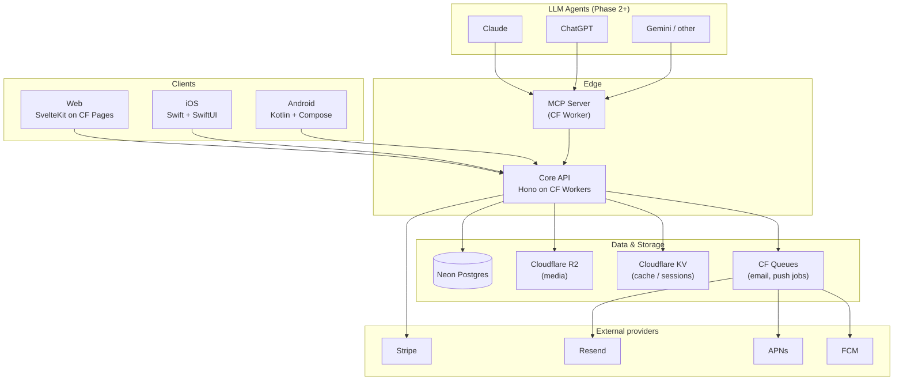

# vite.in v2 — Architecture

**Status:** Draft v1 · April 2026
**Scope:** Complete rebuild of vite.in as a global invitation platform with Web, native iOS, native Android, and LLM-agent clients.

---

## 1. Guiding principles

1. **API-first.** One API, four clients (Web, iOS, Android, MCP). The OpenAPI spec is the single source of truth — SDKs for each client are generated, not hand-written.
2. **No-account-first.** Event creation requires zero signup. Accounts are an optional upgrade tied to specific capabilities (multi-event dashboard, mobile sync, agent authorization). This is the viral mechanic and cannot be compromised.
3. **Global from day one — architecturally.** Timezones, i18n, RTL, currencies, legal compliance hooks — all present in the schema and code from the first commit. Features roll out gradually; architecture doesn't.
4. **Quality over speed.** No hard deadline. Phase gates are exit-criteria-driven, not date-driven.
5. **Serverless, edge-native.** Runs everywhere, scales to zero, pay-per-use.
6. **Abstractable providers.** Stripe, Resend, APNs/FCM are today's choices. The code treats them as interchangeable so Phase 2+ can add regional alternatives without refactors.

---

## 2. High-level system diagram



---

## 3. Tech stack — decisions & rationale

| Layer                   | Technology                                                                                                        | Why this, not the alternatives                                                                                                                                                                                                                                                        |
| ----------------------- | ----------------------------------------------------------------------------------------------------------------- | ------------------------------------------------------------------------------------------------------------------------------------------------------------------------------------------------------------------------------------------------------------------------------------- |
| **Core API runtime**    | Cloudflare Workers                                                                                                | 300+ edge locations (incl. India for later Phase 3). Cold start < 5ms. Vercel Functions cost 5–10× at scale and run at fewer regions. AWS Lambda is heavier to operate.                                                                                                               |
| **API framework**       | Hono                                                                                                              | Fastest Workers-native framework. OpenAPI plugin is first-class. Simpler than NestJS, more structured than raw Workers.                                                                                                                                                               |
| **Language**            | TypeScript (strict)                                                                                               | Shared types between API, Web, MCP, and the codegen'd SDKs.                                                                                                                                                                                                                           |
| **Database**            | Neon Postgres                                                                                                     | Serverless Postgres with branching (dev/staging/prod via branches). HTTP driver works inside Workers. Scale-to-zero matches cost model. D1 (Cloudflare's SQLite) was considered but write throughput limits and lack of real Postgres features (JSONB, ILIKE, full-text) rule it out. |
| **ORM / Query layer**   | Drizzle ORM                                                                                                       | Type-safe, thin, works in Workers. Migrations are SQL files, not magic. Prisma's engine model is too heavy for Workers.                                                                                                                                                               |
| **Object storage**      | Cloudflare R2                                                                                                     | Zero egress fees (critical for images served from many countries). S3-compatible. Co-located with Workers.                                                                                                                                                                            |
| **Cache / sessions**    | Cloudflare KV + Durable Objects                                                                                   | KV for read-heavy cache (eventually consistent, fast everywhere). DOs for strongly consistent counters, rate limits, and OAuth session locking.                                                                                                                                       |
| **Job queue**           | Cloudflare Queues                                                                                                 | Email sends, push notifications, scheduled reminders. Dead-letter queue for retries.                                                                                                                                                                                                  |
| **Auth**                | Better-Auth                                                                                                       | Open source, self-hostable on Workers. Handles password, magic-link, OAuth providers (Google/Apple for users), and _issues_ OAuth tokens (for agents) in one library. Alternative considered: Clerk — good DX but vendor lock-in and pricing for the B2B tier.                        |
| **Web**                 | SvelteKit + Cloudflare Pages                                                                                      | Kim's known stack. No reason to churn.                                                                                                                                                                                                                                                |
| **iOS**                 | Swift 5.9+, SwiftUI, async/await, URLSession                                                                      | Native, modern, long-term supportable. Minimum iOS 16.                                                                                                                                                                                                                                |
| **Android**             | Kotlin, Jetpack Compose, Ktor client, Coroutines                                                                  | Native, modern. Minimum Android 10 (API 29).                                                                                                                                                                                                                                          |
| **MCP server**          | Separate Cloudflare Worker, TypeScript, official `@modelcontextprotocol/sdk`                                      | Isolated surface (compromise here doesn't touch core API). Acts as OAuth-authorized consumer of the core API.                                                                                                                                                                         |
| **Payments**            | Stripe with a thin `PaymentProvider` interface                                                                    | Global reach today. Interface allows Razorpay/UPI/etc. in Phase 2+ without refactor.                                                                                                                                                                                                  |
| **Transactional email** | Resend                                                                                                            | Already working in v1. Kept. Emails sent via CF Queue to decouple.                                                                                                                                                                                                                    |
| **Push**                | APNs (iOS) + FCM HTTP v1 (Android), both called directly from Workers                                             | No unified-push middleman. Cheaper, more control.                                                                                                                                                                                                                                     |
| **Observability**       | Sentry + Cloudflare Workers Analytics + Logpush to R2                                                             | Sentry for errors across all clients. CF Analytics for API perf. Logpush archives raw logs to R2 for audit.                                                                                                                                                                           |
| **Monorepo (TS parts)** | pnpm workspaces + Turborepo                                                                                       | Web, API, MCP, shared-types, SDK. iOS and Android stay as separate repos.                                                                                                                                                                                                             |
| **CI/CD**               | GitHub Actions + Wrangler (API/MCP) + CF Pages auto-deploy (Web) + Xcode Cloud (iOS) + GitHub Actions for Android | Each stack uses native tooling; no single orchestrator forced on all.                                                                                                                                                                                                                 |
| **Feature flags**       | Cloudflare KV-backed flag service (simple) or PostHog if analytics becomes primary                                | Start simple, upgrade if needed.                                                                                                                                                                                                                                                      |
| **Analytics**           | PostHog (self-host or cloud EU)                                                                                   | Event tracking across all clients. EU hosting for GDPR.                                                                                                                                                                                                                               |

---

## 4. Repository structure

Two top-level repositories reflect the open-core model (see §13):

```
github.com/vitein/vitein               # PUBLIC, AGPLv3 (mobile apps MIT/AGPL per repo)
├── apps/
│   ├── api/                           # Cloudflare Worker — Core API
│   ├── web/                           # SvelteKit (core UI; branded overrides live in premium)
│   └── mcp/                           # Cloudflare Worker — MCP server (MIT, for ecosystem)
├── packages/
│   ├── openapi-spec/                  # The source of truth
│   ├── ts-sdk/                        # Generated TypeScript client
│   ├── db-schema/                     # Drizzle schema + migrations
│   ├── shared-types/                  # Domain types
│   ├── i18n-messages/                 # Paraglide messages
│   └── config/                        # Shared eslint, tsconfig, prettier
├── templates-community/               # Open-source templates (PR-contributable)
├── infra/                             # Wrangler configs, Terraform for Neon/Sentry
├── docs/
│   ├── ARCHITECTURE.md
│   ├── ROADMAP.md
│   ├── PROJECT_PLAN.md
│   └── decisions/                     # ADRs (lightweight)
├── .github/                           # CONTRIBUTING, CODE_OF_CONDUCT, CLA, templates
├── LICENSE                            # AGPLv3
├── CLAUDE.md                          # Monorepo-root instructions
├── pnpm-workspace.yaml
└── turbo.json

github.com/vitein/vitein-premium       # PRIVATE, proprietary
├── features/
│   ├── advanced-analytics/
│   ├── branded-templates/
│   └── ai-design-generator/           # Phase 3+
├── brand-assets/                      # Logos, marketing imagery, specific design tokens
├── marketing-content/                 # Landing page copy, blog posts
└── README.md                          # "Sidecar service, extends @vitein/api via HTTP"

github.com/vitein/vite-in-ios          # Separate repo, AGPLv3
github.com/vitein/vite-in-android      # Separate repo, AGPLv3
```

At runtime, the deployed vite.in service is `vitein` + `vitein-premium` composed together. The premium features register with the core API via a documented extension interface (Phase 0 decision: HTTP-based extension points vs compile-time DI — see §15.6).

Why iOS and Android live separately: different toolchains (Xcode, Gradle), different CI, different release cadences, different code review audiences. A monorepo buys nothing but friction here.

---

## 5. Authentication & identity model

Three personas. Each gets a distinct credential type. The first is what makes vite.in viral.

### 5.1 Anonymous creator (the default path)

- Creator enters: event details + their email.
- API generates an **Event Creator Token** — a random 256-bit secret.
- Token is stored _hashed_ (argon2id) against the event, plain token is sent exactly once via magic-link email.
- Creator uses the magic link to manage their event (view RSVPs, edit, resend reminders).
- If the magic link is lost: creator enters email on `/recover`, receives a fresh link for any events tied to that email.
- No password. No account. No friction.
- Premium (paid) events use the same token model; payment just unlocks feature flags on the event record.

### 5.2 Registered user (optional upgrade)

Triggers for an account:

- User wants a dashboard across multiple events.
- User installs the mobile app and wants sync.
- User wants to authorize an AI agent.
- User wants to reuse templates / design preferences.

Implementation:

- Email + magic-link primary (no passwords by default — reduces support load). Passwords optional.
- Sign-in with Apple + Google as social providers.
- On signup, all past events tied to that email are auto-claimed.
- Data model: `users.id` is nullable on `events.creator_user_id`. Anonymous events just don't have it set.

### 5.3 Agent / machine identity

Three sub-scenarios, introduced in order:

**Phase 2: Scenario 1 — User-delegated agents (OAuth 2.1 + PKCE)**

- User authorizes "Claude" (or any MCP-enabled client) to act on their behalf.
- Flow: user clicks "Connect vite.in" in Claude → vite.in OAuth screen → user approves scopes → refresh + access token issued.
- Scopes: `events:read`, `events:write`, `guests:read`, `guests:write`, `rsvps:read`, `templates:read`.
- Access token TTL: 1 hour. Refresh token TTL: 60 days, rotating.
- Requires the user to have an account (this is the monetization conversion point).

**Phase 2b/3: Scenario 2 — Power-user API keys**

- Dashboard-issued keys, tied to a user, no OAuth dance.
- Stricter rate limits than OAuth tokens.
- Intended for: individual event planners automating their own workflows, internal scripts.

**Phase 3: Scenario 3 — Third-party OAuth apps**

- Developers register an app in `developers.vite.in`.
- Users authorize specific apps (like "Sign in with Google" shows which apps have access).
- Per-app rate limits, per-app analytics, possible revenue share if paid features are invoked.

### 5.4 The MCP server's role

The MCP server is NOT a separate auth authority. It is itself an OAuth client of the core API. When Claude talks to the MCP server, Claude presents a token; the MCP server validates it via the core API and forwards authorized operations. Compromising the MCP server does not compromise user data — it only exposes the attack surface of whatever the currently-connected user already authorized.

---

## 6. Data model

Below is the Phase 1 schema. Fields marked _(P2)_ or _(P3)_ are added in later phases but the design anticipates them.

### 6.1 Core entities

**`users`** (optional — only for registered users)

```
id             uuid pk
email          citext unique not null
email_verified_at  timestamptz
password_hash  text null           -- magic-link users have none
locale         text default 'en'
timezone       text default 'UTC'  -- IANA tz (e.g. 'Europe/Zurich')
display_name   text null
created_at     timestamptz default now()
updated_at     timestamptz default now()
deleted_at     timestamptz null
```

**`events`**

```
id                   uuid pk
slug                 text unique not null     -- random (free) or custom (paid)
title                text not null
description          text null
starts_at            timestamptz not null
ends_at              timestamptz null
timezone             text not null             -- IANA tz of the event
location_text        text null
location_lat         numeric(10,7) null
location_lng         numeric(10,7) null
creator_email        citext not null
creator_user_id      uuid null references users(id)
is_paid              boolean default false
paid_features        jsonb default '{}'        -- {no_branding, custom_slug, reminders, media_upload, password_protected, email_invites}
payment_provider     text null                 -- 'stripe'
payment_ref          text null                 -- Stripe checkout session id
password_hash        text null                 -- if password-protected
cover_media_id       uuid null                 -- fk to event_media, nullable cycle resolved via deferred
default_locale       text default 'en'         -- invitation's "base" language
visibility           text default 'link_only'  -- 'link_only' | 'public' | 'unlisted' (P2)
deleted_at           timestamptz null
created_at, updated_at
```

**`event_tokens`** — magic-link & management tokens

```
id             uuid pk
event_id       uuid fk events
token_hash     text unique not null   -- argon2id
purpose        text not null          -- 'manage' | 'view_private' | 'agent_delegation' (P2)
expires_at     timestamptz null
revoked_at     timestamptz null
created_at     timestamptz default now()
```

**`guests`** — invited people (distinct from RSVPs — this is the _invite list_)

```
id             uuid pk
event_id       uuid fk events
name           text null
email          citext null
phone          text null                -- E.164
invited_via    text not null            -- 'link' | 'email' | 'sms' | 'whatsapp' | 'agent'
invited_at     timestamptz default now()
```

**`rsvps`** — responses (a guest may RSVP, or a walk-in may RSVP via the public link)

```
id             uuid pk
event_id       uuid fk events
guest_id       uuid null fk guests       -- null = walk-in via public link
name           text not null
email          citext null
status         text not null             -- 'yes' | 'maybe' | 'no'
plus_ones      int default 0
message        text null
responded_at   timestamptz default now()
```

### 6.2 Localization & media

**`event_translations`** _(P1 schema, P2 active feature)_

```
id             uuid pk
event_id       uuid fk events
locale         text not null              -- 'de', 'en', 'hi-IN', etc.
title          text not null
description    text null
created_at, updated_at
unique(event_id, locale)
```

**`event_media`**

```
id             uuid pk
event_id       uuid fk events
r2_key         text not null
kind           text not null              -- 'cover' | 'gallery'
mime_type      text not null
size_bytes     int not null
width, height  int null
position       int default 0
created_at
```

### 6.3 Auth / OAuth tables _(P2)_

**`oauth_clients`** — registered MCP and third-party apps

```
id             uuid pk
name           text not null
owner_user_id  uuid null                  -- null for official first-party (MCP)
client_id      text unique
client_secret_hash text
redirect_uris  text[]
allowed_scopes text[]
is_first_party boolean default false
created_at
```

**`oauth_authorizations`** — per-user, per-client consent

```
id             uuid pk
user_id        uuid fk users
client_id      text fk oauth_clients(client_id)
scopes         text[]
revoked_at     timestamptz null
created_at
```

**`oauth_tokens`**

```
id             uuid pk
authorization_id uuid fk oauth_authorizations
token_hash     text unique                -- access or refresh
token_type     text                       -- 'access' | 'refresh'
expires_at     timestamptz
revoked_at     timestamptz null
created_at
```

**`api_keys`** _(P3)_ — power-user keys

```
id             uuid pk
user_id        uuid fk users
key_hash       text unique
key_prefix     text                       -- first 8 chars, for UI display
name           text
last_used_at   timestamptz
revoked_at     timestamptz null
created_at
```

### 6.4 System & audit

**`audit_log`** _(append-only)_

```
id             uuid pk
actor_type     text                       -- 'creator_token' | 'user' | 'oauth_token' | 'api_key' | 'system'
actor_id       text
event_id       uuid null
action         text                       -- 'event.create', 'rsvp.submit', 'payment.complete', etc.
metadata       jsonb
ip_hash        text null                  -- not raw IP, salted hash
created_at     timestamptz default now()
```

**`webhooks`** _(P2)_

```
id, event_id, url, secret_hash, event_types text[], enabled, created_at
```

### 6.5 Design principles applied

- **Soft delete** via `deleted_at` on user-facing entities. Hard delete only on GDPR request (cascading).
- **Every write goes to `audit_log`**. This is the ground truth; tables are derived state.
- **No implicit timezone assumption**. Every `timestamptz` is UTC; every event carries its own `timezone` separately.
- **`jsonb` for `paid_features`** because the feature bundle evolves faster than schema migrations — but each feature is a typed boolean in code.
- **`citext` for emails** — case-insensitive comparisons without lowercase-everything hacks.

---

## 7. API design

### 7.1 The OpenAPI spec is the contract

- Lives in `packages/openapi-spec/vitein.yaml`.
- Every change is a PR that also regenerates the SDK.
- No API endpoint exists in code without being in the spec.
- Examples for every operation (required by generator and for docs).

### 7.2 Versioning

- URL versioning: `/v1/events`, `/v2/...`.
- Deprecation window: 12 months. Sunset header (`Sunset: Tue, 31 Jan 2027 00:00:00 GMT`) when deprecating.
- Breaking changes require a new major version. Clients pin to major.

### 7.3 Authentication headers

```
Authorization: Bearer <token>           # user / OAuth / API key — discriminated by token format
X-Creator-Token: <creator-token>        # anonymous creator management
```

### 7.4 Rate limits (Phase 1 defaults)

| Actor                   | Read       | Write     |
| ----------------------- | ---------- | --------- |
| Anonymous (per IP-hash) | 100 / min  | 20 / min  |
| Creator token           | 300 / min  | 60 / min  |
| Authenticated user      | 600 / min  | 120 / min |
| OAuth agent token       | 300 / min  | 60 / min  |
| API key                 | 1000 / min | 200 / min |

Implemented via Durable Objects (strong consistency per key).

### 7.5 Error shape

```json
{
  "error": {
    "code": "event.not_found",
    "message": "Human-readable, localized per Accept-Language",
    "request_id": "req_01h...",
    "details": {
      /* optional */
    }
  }
}
```

Codes are dotted, stable, and documented. Clients branch on `code`, not `message`.

---

## 8. Internationalization & localization

### 8.1 What's localized

| Surface                  | How                                                                                            |
| ------------------------ | ---------------------------------------------------------------------------------------------- |
| Web UI                   | Paraglide (already in v1, keep)                                                                |
| Mobile UI                | Platform-native `.strings` / `strings.xml`, sourced from shared i18n messages                  |
| Email templates          | Handlebars templates with locale lookup, queued via CF Queues                                  |
| API error messages       | Localized per `Accept-Language`, falls back to `en`                                            |
| Event invitation content | Creator chooses `default_locale`; Phase 2 adds `event_translations` for multi-lang invitations |
| Date / time formatting   | Client-side with Intl API (web), native formatters (iOS/Android)                               |
| Currency display         | ISO 4217 codes in API, formatted client-side                                                   |

### 8.2 Launch languages (Phase 1)

`en` (source), `de`, `fr`, `es`, `it`, `pt`, `nl`, `pl`. Priority based on existing v1 traffic + early TAM.

### 8.3 RTL readiness

- All CSS uses logical properties (`margin-inline-start`, never `margin-left`).
- Components tested in RTL mode in Storybook.
- Arabic and Hebrew added in Phase 2 when RTL QA can be resourced.

### 8.4 Cultural template variants (Phase 3)

The `events` table has a `template_id` (added in P2). Templates can specify:

- Color palette defaults
- Typography
- Optional fields (e.g. Indian weddings have multi-day/multi-function structure; Western weddings don't)
- Content tone

This means an "Indian wedding" template isn't a skin, it's a content-model variant. Schema-supported, just not activated until Phase 3.

---

## 9. Security

### 9.1 Threat model (brief)

| Threat                                    | Mitigation                                                                          |
| ----------------------------------------- | ----------------------------------------------------------------------------------- |
| Event hijack via guessed slug             | 22-char random slugs for free tier; rate-limited enumeration                        |
| Creator token theft via email forwarding  | Tokens scoped to a single event, revocable, rotatable                               |
| RSVP spam                                 | Rate limit per IP-hash per event; optional hCaptcha if abuse detected               |
| Credential stuffing on accounts           | Magic-link primary, passwords with HIBP check                                       |
| Agent scope escalation                    | Scopes validated on every request; scope-minimal by default                         |
| Payment replay / webhook forgery          | Stripe signature verification; idempotency keys on all write operations             |
| Image upload abuse                        | Size limits, MIME sniff, re-encode on server (Cloudflare Images), malware scan hook |
| IDOR on events/rsvps                      | Every query filters by authorization context; integration tests assert              |
| SSRF via user-provided URLs (P2 webhooks) | Allowlist-based URL validator, no private IP ranges, no cloud metadata endpoints    |

### 9.2 Secrets

- All secrets in Wrangler encrypted env vars, never in code.
- Rotation playbook documented in `docs/ops/secrets-rotation.md`.
- Staging and production have separate secret sets.

### 9.3 Compliance hooks (ready from day 1)

- **Data export endpoint** (`GET /v1/users/me/export`) returns all user data as JSON. Required by GDPR.
- **Account deletion endpoint** (`DELETE /v1/users/me`) triggers cascade delete with 30-day grace period.
- **Audit log** already captures actor + action + timestamp.
- **Cookie consent** banner on web, regional (EU shows more; US minimal). Managed server-side via a consent record.

---

## 10. Observability

| Signal                                                            | Where                                              | Retention                         |
| ----------------------------------------------------------------- | -------------------------------------------------- | --------------------------------- |
| Errors (all clients)                                              | Sentry                                             | 90 days                           |
| API request logs                                                  | Cloudflare Logpush → R2                            | 1 year (compliance)               |
| API performance metrics                                           | CF Workers Analytics                               | 30 days in UI, longer via Logpush |
| Business events (event.created, payment.complete, rsvp.submitted) | PostHog                                            | Indefinite (sampled)              |
| Uptime                                                            | Cloudflare + external (e.g. Uptime Kuma on Fly.io) | N/A                               |

Every log line carries `request_id`, `user_id` (if any), and `event_id` (if any). Tracing via W3C `traceparent` headers across MCP → API.

---

## 11. Non-goals (explicitly)

To keep the project focused, these are deliberately out of scope:

- **Video invitations / streaming.** Static media only in v1. Video is a Phase 3 conversation at earliest.
- **In-app chat between guests.** RSVPs with messages are the extent of social features in v1.
- **Marketplace for templates / paid designs.** Nice idea, dedicated project if pursued.
- **White-label reseller product.** B2B will address some of this in Phase 2, but full white-label is Phase 3+.
- **Offline-first mobile apps.** Apps will cache recent data but require connectivity for writes. True offline-first is expensive and not worth it for this product.
- **Self-hosted / on-prem deployment.** SaaS only for vite.in as a service. The open-core code (see §13) can be self-hosted by anyone; we don't support it, but the license permits it.

---

## 12. Pricing & billing

### 12.1 Product structure — two tiers, one-time payment per event

vite.in uses a **tiered, pay-per-event** model — no subscriptions. Events are emotional, singular moments; a subscription would feel wrong. Instead, each event has an optional premium upgrade with a natural tier split.

**Basic — "5" units** (Phase 1 from launch)
The core premium bundle: no vite.in branding, custom slug (`vite.in/annas-30ter`), reminder emails to guests. This is the high-conversion impulse purchase — the majority of paid events will sit here.

**Plus — "9" units** (Phase 1 from launch)
Upsell tier for formal / higher-stakes events (weddings, corporate, large parties). Includes everything in Basic plus:

- Plus-Ones management (guests can bring +1 with named details)
- Password protection (for events that aren't meant to be public)
- Save-the-Date (separate announcement wave before the full invitation)

**Pro — "19" units** (Phase 2, not at launch)
Reserved for Phase 2. Likely features: event bundles / annual passes for frequent hosts, team access (for couples planning together), custom guest questions (menu, allergies), analytics, CSV export. Phase 2 decision — not locked yet.

### 12.2 Pricing model — fixed anchors, not FX conversion

We use fixed price anchors per currency, not dynamic FX conversion. This is the Apple/Netflix/Spotify pattern: `$5` in the US is `€5` in the Eurozone, not `$5.43`. Benefits: simple mental anchor, no FX fee exposure, stable P&L per market, no price jitter.

### 12.3 Phase 1 launch — four currencies

Launch with the four largest Stripe-mature markets where `5` is a natural, non-absurd price point:

| Currency | Basic | Plus | Notes                                |
| -------- | ----- | ---- | ------------------------------------ |
| EUR      | €5    | €9   | Home market                          |
| USD      | $5    | $9   | US + LATAM fallback                  |
| CHF      | 5     | 9    | Swiss market (Kim's base)            |
| GBP      | £4    | £7   | UK (rounded down for GBP psychology) |

Why these four: mature Stripe support, no aggressive Purchasing-Power-Pricing needed (all four are in the ~100% PPP bracket), minimal legal/tax complexity for a solo founder pre-OÜ, fast launch.

### 12.4 Phase 1.5 — India PPP (4 weeks post-launch)

India is the sole Phase 1.5 addition, added approximately 4 weeks after Phase 1 launch. Rationale:

- The `.in` TLD organically attracts Indian traffic; `5 EUR` would convert at near-zero rate.
- India is where the _.in_-story actually starts to pay off.
- Only one market to test PPP mechanics before committing to more.

| Currency | Basic | Plus |
| -------- | ----- | ---- |
| INR      | ₹149  | ₹299 |

### 12.5 Phase 2 — broad PPP rollout

Once Phase 1.5 validates the PPP mechanics and we have real traffic data on which markets matter, we extend to additional markets. The table below is **planning-level**, not committed — actual adoption depends on traffic signals:

| Currency | Basic     | Plus      | PPP vs EU                             |
| -------- | --------- | --------- | ------------------------------------- |
| BRL      | R$15      | R$29      | ~55%                                  |
| MXN      | MX$49     | MX$99     | ~55%                                  |
| JPY      | ¥500      | ¥980      | ~95%                                  |
| TRY      | ₺49       | ₺99       | ~20%                                  |
| ARS      | ARS 2.000 | ARS 3.900 | ~30%                                  |
| AUD      | A$8       | A$14      | Stronger currency, deliberate premium |
| CAD      | C$7       | C$13      | Similar logic                         |
| SGD      | S$7       | S$13      |                                       |

### 12.6 Geo-detection & arbitrage handling

**Price-shown logic:**

- Browser IP → geolocate → suggest matching currency/tier
- User can manually override via checkout currency dropdown
- **Billing address (not IP) determines the actual charged price** — Stripe's Customer Location Detection handles this

**Arbitrage posture:** _Soft geo-enforcement_. We accept that some users in high-income markets will use Indian prices via VPN. Estimated loss: 5–15% of upper-tier revenue. Trade-off is deliberate — the conversion uplift in emerging markets outweighs it, and the alternative (hard geo-verification requiring matching IP + card country) damages legitimate travelers and expats.

### 12.7 Stripe configuration

**Product structure:**

- **One Stripe `Product` per tier**: `vite.in Event — Basic`, `vite.in Event — Plus`.
- **One `Price` object per currency, per tier**, all linked to their tier's product.
- Phase 1: 4 currencies × 2 tiers = 8 Price objects.
- Phase 1.5: +2 (INR × 2 tiers) = 10 total.
- Phase 2 broad rollout: potentially 20+ total.

**Runtime behavior:**

- API never hard-codes prices. Prices are fetched from Stripe at checkout initiation, cached with a short TTL.
- The `events.paid_features` jsonb stores which tier was purchased (`{ tier: 'plus', bundle_version: 1 }`), decoupling feature flags from payment specifics.
- A/B tests on pricing route through feature flags on the checkout-initiation endpoint, never via different price IDs leaking to the client.

### 12.8 Tax handling

- **Stripe Tax** enabled from day 1 across all launch markets.
- EU buyers: VAT One-Stop-Shop (OSS) via the Estonia OÜ once registered (pre-OÜ, Kim's individual VAT status applies per Swiss residency rules).
- UK buyers: separate VAT registration threshold monitored via Stripe Tax.
- US buyers: Stripe Tax handles state-level sales tax automatically.
- Indian buyers (Phase 1.5+): GST handling via Stripe Tax; registration threshold monitored (~₹20 Lakh annual turnover triggers mandatory GST registration).
- Tax is displayed **exclusive** of the listed price (consistent across markets; local law-permitted in all launch markets).

### 12.9 Refunds & disputes

- **Refund policy:** no questions asked within 14 days of purchase, as long as no reminders have been sent to guests (`reminders_sent_at IS NULL`). Published clearly on the checkout page.
- **Chargebacks** reviewed weekly for the first 6 months post-launch; Stripe's fraud signals inform automated blocks for repeat offenders.
- **Currency of refund** matches currency of purchase — we do not refund in different currency.

### 12.10 Migration path for v1 customers

Not a concern — v1 is being archived, v2 launches fresh. Any v1 customer with unfulfilled value (edge case) gets a free Plus event on v2 via a one-time coupon.

---

## 13. Open-core licensing & repository split

vite.in is built as an **open-core** project: the platform that powers it is open source; the specific brand, premium features, and curated templates that make it "vite.in the service" are closed. This is the Sentry / Plausible / GitLab model.

### 13.1 What's open, what's closed

**Open source (AGPLv3):**

- `apps/api` — Core API (events, RSVPs, guests, auth, payments plumbing)
- `apps/web` — Core web UI (landing-page theme can be overridden; functional components are open)
- `apps/mcp` — MCP server (MIT-licensed to encourage LLM ecosystem adoption — more permissive than AGPL)
- `packages/*` — all shared packages (OpenAPI spec, SDK generators, DB schema, i18n tooling)
- Mobile apps (`vite-in-ios`, `vite-in-android`) — AGPLv3
- Community template collection

**Closed source (proprietary, in a separate private repo):**

- `vitein-premium/` — implementation of premium features that we sell
  - Specific premium template designs we author
  - Advanced analytics dashboard
  - Marketing-site content (copy, imagery, SEO assets)
  - Our branded design system (tokens that identify vite.in specifically — not the design-system _framework_)
- Future: advanced AI-generated design features, B2B team controls with SSO, agent abuse-prevention heuristics

**Rationale for the split:**

- Anyone can self-host a fully functional invitation platform. No crippling.
- But they can't just rebrand our service and compete with us — the premium layer is our competitive surface.
- Template contributors have a natural way to contribute (public repo, PR flow).
- The AGPL license means any SaaS fork must open-source their changes too. This is the strongest open-source license for SaaS.

### 13.2 Repository structure

```
github.com/vitein/vitein             PUBLIC, AGPLv3
  └── as per Architecture §4

github.com/vitein/vitein-premium     PRIVATE, proprietary
  ├── features/
  │   ├── advanced-analytics/
  │   ├── branded-templates/
  │   └── ...
  ├── brand-assets/
  └── README.md explaining: "imports from @vitein/api via published types, runs as a sidecar or mounted sub-app"
```

At runtime, the deployed `vite.in` service = open core + premium bolted on. An integration point (HTTP-based extensions or compiled-in feature flags) lets premium features plug in without leaking into the open repo.

### 13.3 Contribution model

- **CLA required** for all external contributors. Standard boilerplate (something like the Apache ICLA). Lets us re-license contributions if we ever need to (e.g. to keep the premium layer compatible).
- **CONTRIBUTING.md, CODE_OF_CONDUCT.md, issue + PR templates** live in the public repo from day 1.
- **Templates are a first-class contribution path.** Designers can submit templates via PR; we curate which make it into the free pool.
- **Security disclosures** go through a separate email / GitHub Security Advisory channel, not public issues.

### 13.4 Community infrastructure (Phase 1 readiness)

- GitHub Discussions enabled.
- `docs.vite.in` hosts both user docs and developer docs (MCP integration, self-hosting).
- `status.vite.in` for service transparency.
- Public roadmap (a lightweight subset of `ROADMAP.md`, not the detail).

### 13.5 Phase-ordered execution

- **Phase 0:** License files, CLA tooling, public/private repo creation. No public marketing of open-source status — we're not ready to handle issues yet.
- **Phase 1:** Soft-launch OSS alongside product launch. "We're open source" becomes a talking point. Community feedback welcomed but not solicited aggressively.
- **Phase 2:** Active community growth: templates marketplace submissions, MCP ecosystem evangelism, blog posts about self-hosting.
- **Phase 3:** Developer portal, SDK versioning for third-party apps, potential sponsorship / funding paths (GitHub Sponsors, OpenCollective) if it makes sense.

---

## 14. Legal entity & payments plumbing

### 14.1 Entity transition

Kim operates as an individual during early Phase 0/1 and transitions to **Estonia OÜ** once registration completes. Implications:

- **Stripe account:** Use Stripe's "change legal entity" flow when the OÜ is ready. Do not open two accounts — it fragments revenue history and complicates tax reporting.
- **VAT registration:** Estonia OÜ registers for EU VAT-OSS. Until registration, individual operation is below the VAT threshold in most jurisdictions, but we still _display_ tax-inclusive or tax-exclusive prices consistently.
- **Contracts with providers:** Initial signups (Neon, Cloudflare, Resend, Sentry, PostHog) are on individual account. Transfer to OÜ happens via support tickets once entity exists; plan a batch transfer in a single week to avoid confusion.
- **Data processing agreements (DPAs):** Signed by OÜ with each sub-processor. Individual is not in a position to offer DPAs to B2B customers — this is one reason B2B is deliberately Phase 2 (post-OÜ).

### 14.2 What the OÜ enables

- Clean DPA offering for future B2B customers.
- Proper corporate Stripe account with no personal liability on chargebacks.
- Employee / contractor hiring paths if the project grows.
- 0% corporate tax on retained earnings under Estonian regime — profits reinvested into development stay untaxed until dividends are paid.

---

## 15. Open architectural questions (to resolve in Phase 0)

1. **Email deliverability strategy.** Resend works, but as we scale globally, does one provider suffice? Consider Postmark for transactional reliability + Resend for marketing splits. _Decision in Phase 0 week 1._
2. **Webhook implementation for Phase 2.** Built into the core API or delegated to a dedicated service (Hookdeck, Svix)? _Decision in Phase 1 mid-point when Phase 2 scoping begins._
3. **Template designer tooling for non-devs.** Do we build an in-house template editor (Phase 3) or use a headless CMS (Sanity, Contentful)? _Decision when Phase 3 planning begins._
4. **iOS / Android auth token storage.** Keychain + Keystore is the obvious answer. Confirm biometric gate requirements before Phase 1 mobile work. _Decision in Phase 1 mobile sprint._
5. **SDK generation tooling.** `openapi-typescript-codegen` for TS, `openapi-generator` for Swift/Kotlin, or different per platform? _Decision in Phase 0 week 1._
6. **Premium repo integration mechanism.** HTTP-based extension point (separate Worker) or compile-time dependency injection? Former is cleaner for isolation; latter is simpler to operate. _Decision in Phase 0 week 2._
7. **CLA tooling choice.** EasyCLA, CLA Assistant, or custom DCO? EasyCLA is most standard for AGPL projects. _Decision in Phase 0 week 1._
